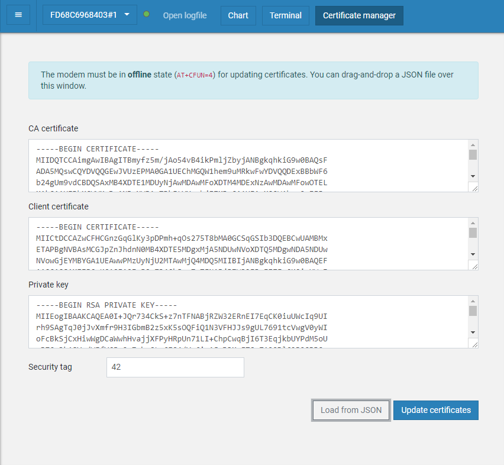

# Connect using a real device

You can use a Thingy:91 to connect to your account.

In order for the device to connect you need to

1. Update the modem firmware
1. Flash the certificate
1. Flash the application firmware

## Updating the modem firmware

Flash
[`mfwnrf9160100.zip`](https://www.nordicsemi.com/-/media/Software-and-other-downloads/Dev-Kits/nRF9160-DK/mfwnrf9160100.zip)
using the _Programmer_ of the
[nRF Connect for Desktop](https://www.nordicsemi.com/Software-and-Tools/Development-Tools/nRF-Connect-for-desktop)
app.

Click _Update modem_ and select the ZIP file:

Click _Write_ and wait until the update has finished.

## Flashing the certificate

You can use the `certificates/device-<deviceId>.json` file with the _Certificate
Manager_ in the
[nRF Connect for Desktop](https://www.nordicsemi.com/Software-and-Tools/Development-Tools/nRF-Connect-for-desktop)
app _LTE Link Monitor_ to flash certificate onto the device.

The _Certificate Manager_ uses AT commands to write the certificate information
to the secure storage of the modem and you need to flash your device with a
firmware that has the AT command host enabled.

Flash
[`thingy91_at_client_increased_buf.hex`](https://github.com/bifravst/bifravst/releases/download/v4.2.1/thingy91_at_client_increased_buf.hex)
using the _Programmer_ app.

Drag and Drop (or select via _Add HEX file_) the
[`thingy91_at_client_increased_buf.hex`](https://github.com/bifravst/bifravst/releases/download/v4.2.1/thingy91_at_client_increased_buf.hex),
click _Erase & Write_ and wait until the operation has finished.

Afterwards, launch the _LTE Link Monitor_ app.

Use the _Certificate Manager_ with the JSON file to write the certificate to the
device.

Drag and Drop or select the JSON file.

**Note:** Change the security tag to `42`. The modem can hold multiple
credentials, and the default security tag (`16842753`) is reserved for
[nRF Connect for Cloud](https://www.nordicsemi.com/Software-and-Tools/Development-Tools/nRF-Connect-for-Cloud)
credentials.

Click _Update certificates_ and wait until the operation finishes.

## Flashing the application

Now use the _Programmer_ app again to flash the Cat Tracker firmware:
[`cat_tracker.hex`](https://github.com/bifravst/bifravst/releases/download/v4.2.1/cat_tracker.hex).
