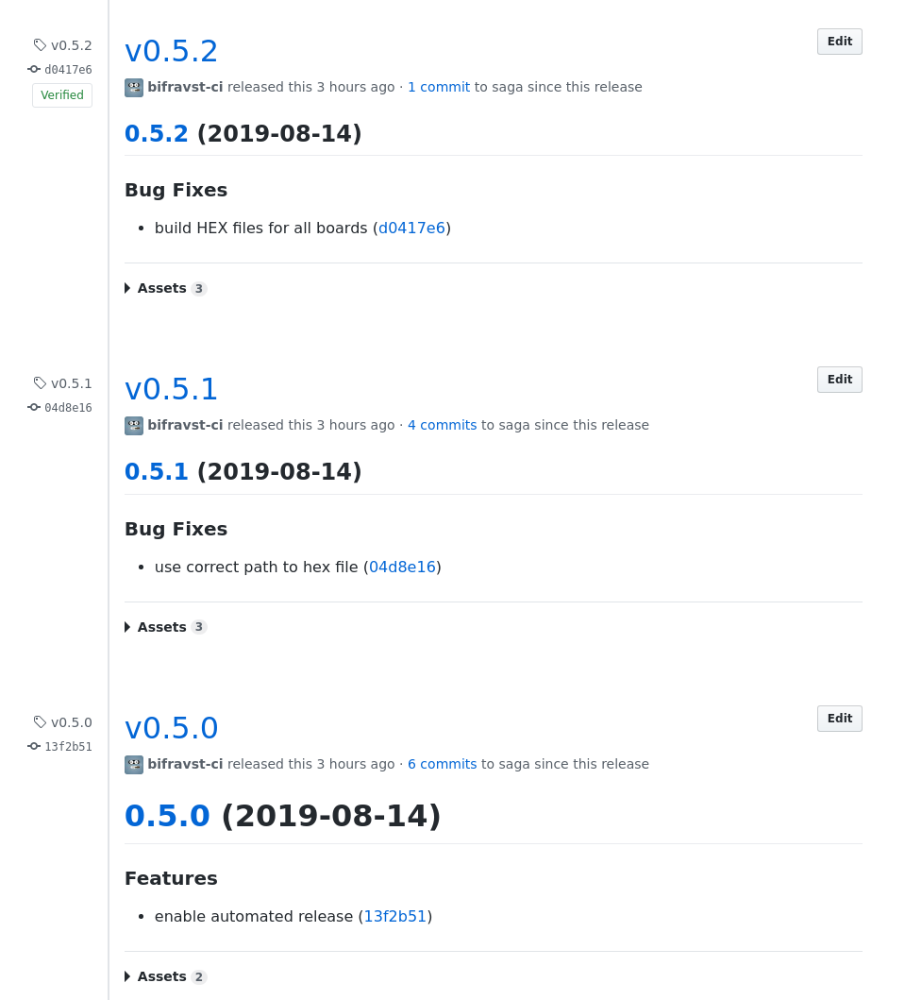

# Guide: Automate building of HEX files for your nRF Connect SDK application

> This guide was originally published
> [on the {DevZone blog](https://devzone.nordicsemi.com/nordic/nordic-blog/b/blog/posts/automate-building-of-hex-files-for-your-nrf-connect-sdk-application-using-circleci).

Continuous delivery is in important aspect of short time to market and since the
nRF9160
[supports firmware over the air updates](https://github.com/NordicPlayground/fw-nrfconnect-nrf/tree/master/samples/nrf9160/aws_fota) we
want to ship a new firmware to our development boards every time we update the
application.

One precondition for that is the automation of the process that builds the HEX
file of an application.

In this example I'll provide the configuration for Circle CI, a continuous
integration service, which allows you to run task on their service for free, if
your project is open source.

After signing up for [CircleCI](https://circleci.com/) and connecting it to your
source code provider, you need to provide a configuration file which instructs
the docker-based build system to

- configure the image with the necessary dependencies for Zephyr
- initialize NCS and its dependencies
- build the HEX files for all target devices of your application

Getting all these steps right takes a while, because configuring NCS and Zephyr
includes
[many](https://developer.nordicsemi.com/nRF_Connect_SDK/doc/1.0.0/nrf/gs_ins_linux.html)
[individual](https://developer.nordicsemi.com/nRF_Connect_SDK/doc/1.0.0/zephyr/getting_started/installation_linux.html#linux-requirements)
tasks, but afterwards you have a reproducible recipe to build your HEX files, as
part of your source code project.

Not only does that mean you can provide up-to-date HEX files with zero effort,
but using a CI runner allows you to automate your software releases using a
project called
[semantic release](https://github.com/semantic-release/semantic-release).

> _Note:_ by default `semantic-release` will get the `reposityUrl` it uses to
> determine the changes between releases from the `package.json` which after
> forking the `firmware` repo will still point to
> `https://github.com/bifravst/firmware.git`. Either, update that to the URL of
> your fork, or
> [provide it as an argument to the `semantic-release` CLI](https://semantic-release.gitbook.io/semantic-release/usage/configuration#repositoryurl).

[Here is the workflow definition for GitHub Actions](https://github.com/bifravst/firmware/blob/saga/.github/workflows/build-and-release.yaml)
which automatically builds HEX files and attaches them to the GitHub release.

Following this example, all developers need to do format their commit messages
following a certain schema (you can read more in detail about this process
[here](../Versioning.md#how-to-release-a-new-version-of-a-package)) to trigger a
new release.

